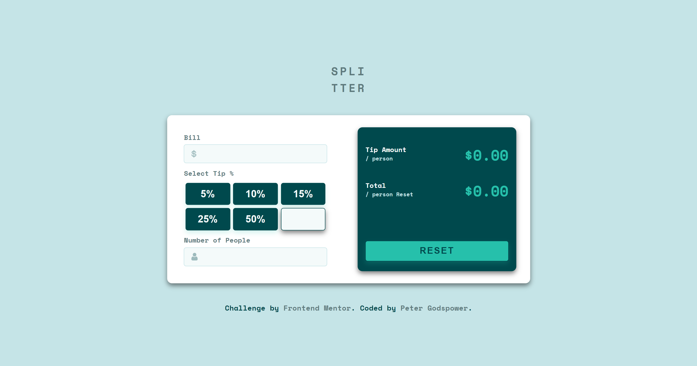
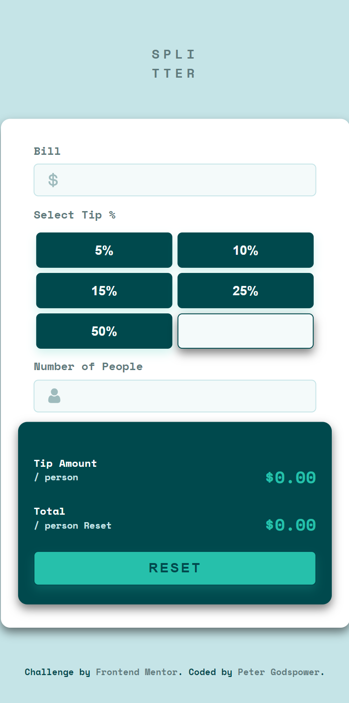

# Frontend Mentor | Tip Calculator App

This is a solution to the Tip Calculator challenge on Frontend Mentor. The project involves creating a responsive tip calculator that allows users to input their bill amount, number of people, and select a tip percentage to calculate the tip amount and total cost.

## Table of Contents

- [Overview](#overview)
  - [Screenshot](#screenshot)
  - [Links](#links)
- [My Process](#my-process)
  - [Built With](#built-with)
  - [What I Learned](#what-i-learned)
  - [Continued Development](#continued-development)
  - [Useful Resources](#useful-resources)
- [Author](#author)
- [Acknowledgments](#acknowledgments)

## Overview

### Screenshot

### Links

- Solution URL: [Frontend Mentor Solution](https://www.frontendmentor.io/solutions/tip-calculator-app)
- Live Site URL: [Live Demo](https://your-live-site-url.com) <!-- Update with actual URL -->

## My Process

I approached this project by creating a responsive and interactive tip calculator using CSS and JavaScript. The application allows users to input their bill amount, number of people, and select a tip percentage to calculate the tip amount and total bill.

### Built With

- **Semantic HTML5 markup:** Structured the content using modern HTML elements for better readability and accessibility.
- **CSS Custom Properties:** Utilized CSS variables for theming and maintaining a consistent design.
- **Flexbox & Grid:** Implemented for layout management and responsive design.
- **Responsive Design:** Employed `clamp()` and viewport-relative units (vw) to ensure fluid layouts across devices.
- **JavaScript:** Managed dynamic data handling, user interactions, and real-time updates.

### What I Learned

This project enhanced my skills in:

- **CSS Variables:** Leveraging custom properties to create a consistent theme and facilitate easy updates.
- **Responsive Design Techniques:** Using modern CSS methods to create adaptable layouts.
- **JavaScript Interactivity:** Handling dynamic calculations, user inputs, and form validation.
- **Error Handling:** Implementing effective feedback mechanisms for user input errors.

### Continued Development

Future improvements and projects will focus on:

- **Advanced JavaScript Features:** Enhancing interactive functionalities and data processing techniques.
- **Improved CSS Styling:** Exploring more advanced CSS animations and effects.
- **Accessibility Enhancements:** Ensuring better accessibility and usability for a wider audience.

### Useful Resources

- [MDN Web Docs](https://developer.mozilla.org/en-US/) - Comprehensive web development documentation.
- [CSS-Tricks](https://css-tricks.com/) - Articles and tutorials on modern CSS practices.
- [Frontend Mentor](https://www.frontendmentor.io/) - Platform for frontend challenges and community support.

## Author

- **Frontend Mentor:** [@YourProfile](https://www.frontendmentor.io/profile/YourProfile) <!-- Update with actual profile link -->
- **GitHub:** [YourGitHubUsername](https://github.com/YourGitHubUsername) <!-- Update with actual GitHub link -->

## Acknowledgments

Special thanks to Frontend Mentor for providing this challenging project and to the community for feedback and support.
